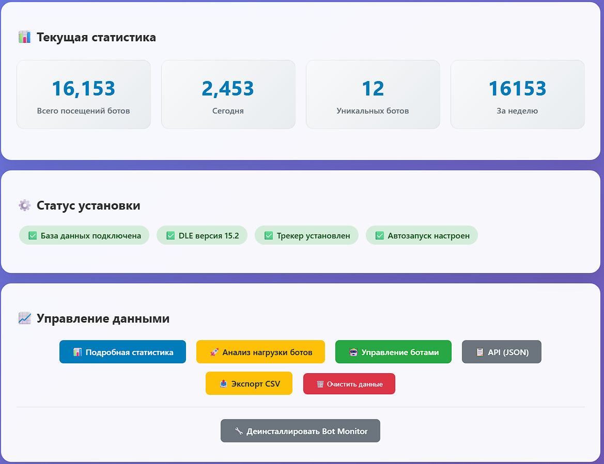
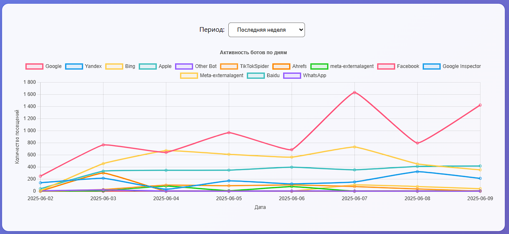
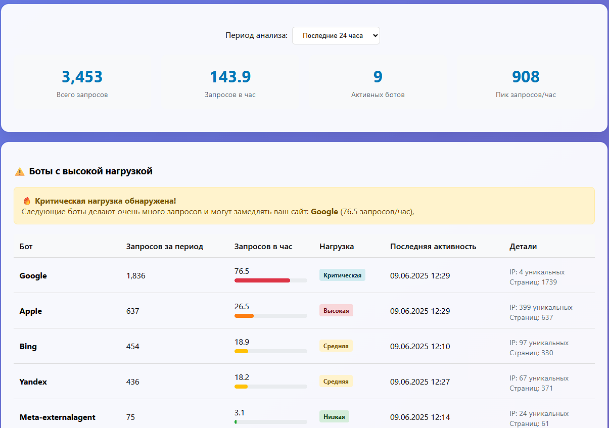

# 🤖 Bot Monitor for DataLife Engine

[](https://php.net)
[](https://dle-news.ru)
[](LICENSE)
[](https://github.com/username/bot-monitor-dle/releases)

> **Универсальный мониторинг поисковых ботов для DataLife Engine**  
> Автономный модуль для отслеживания активности поисковых ботов с детальной статистикой и красивыми графиками

## 📋 Возможности

- 🤖 **Автоматическое отслеживание** 20+ популярных поисковых ботов
- 📊 **Детальная статистика** с интерактивными графиками
- 🚀 **Анализ нагрузки** от ботов на сервер
- 📱 **Адаптивный веб-интерфейс** для всех устройств
- 📤 **Экспорт данных** в CSV/JSON форматах
- ⚡ **Высокая производительность** — минимальное влияние на сайт
- 🔧 **Простая установка** одним кликом
- 🗑️ **Полное удаление** через деинсталлятор

## 🖼️ Скриншоты

| Главная страница | Детальная статистика | Анализ нагрузки |
|:---:|:---:|:---:|
|  |  |  |

## 🚀 Быстрый старт

### Требования

- **DLE:** 15.2+ (автоопределение версии)
- **PHP:** 7.0+ (рекомендуется 8.0+)
- **MySQL/MariaDB:** Любая версия, поддерживаемая DLE

### Установка

1. **Скачайте файл**
   ```bash
   bot_monitor.php
   ```

2. **Загрузите на сервер**
   ```bash
   # Поместите bot_monitor.php в корень сайта (рядом с index.php)
   chmod 644 bot_monitor.php
   chmod 755 engine/modules/
   ```

3. **Запустите установку**
   ```
   http://ваш-сайт.ru/bot_monitor.php
   ```
   
4. **Нажмите кнопку "Установить трекер автоматически"**

✅ **Готово!** Боты начнут отслеживаться автоматически.

## 📖 Подробная документация

### Поддерживаемые боты

Bot Monitor автоматически определяет следующие боты:

| Поисковик | Боты | Статус |
|-----------|------|--------|
| **Google** | Googlebot, Google-InspectionTool, Googlebot-Image, Googlebot-News | ✅ |
| **Yandex** | YandexBot, YandexImages | ✅ |
| **Bing** | bingbot, BingPreview | ✅ |
| **Социальные сети** | Facebookbot, Twitterbot, LinkedInBot, TelegramBot | ✅ |
| **SEO инструменты** | SemrushBot, AhrefsBot, MJ12bot (Majestic), DotBot (Moz) | ✅ |
| **Другие** | DuckDuckBot, Baiduspider, SeznamBot, AppleBot | ✅ |

### Структура файлов

```
your-dle-site/
├── bot_monitor.php                              # Основной файл (вручную)
├── engine/
│   ├── modules/
│   │   └── bot_tracker.php                      # Создается автоматически
│   └── data/
│       └── bot_monitor_custom_bots.json         # Создается автоматически
└── database table: {PREFIX}_bot_visits          # Создается автоматически
```

### API Endpoints

Bot Monitor предоставляет RESTful API для интеграции:

```bash
# Базовая статистика (JSON)
GET /bot_monitor.php?action=api&format=json

# Статистика за период
GET /bot_monitor.php?action=api&period=30

# Экспорт в CSV
GET /bot_monitor.php?action=export&format=csv&period=7
```

**Пример ответа API:**
```json
{
  "basic_stats": {
    "total": 1543,
    "today": 23,
    "unique_bots": 12,
    "this_week": 156
  },
  "detailed_stats": {
    "top_bots": [...],
    "chart_data": [...]
  },
  "generated_at": "2025-06-09 15:30:00",
  "dle_version": 17.2
}
```

## ⚙️ Конфигурация

### Добавление пользовательских ботов

1. Перейдите в `Bot Monitor → Управление ботами`
2. Заполните форму:
   - **Сигнатура:** часть User-Agent для определения
   - **Название:** отображаемое имя бота
3. Нажмите "Добавить бота"

**Пример:** Для бота с User-Agent `MyCustomBot/1.0` укажите сигнатуру `MyCustomBot`

### Ручная установка

Если автоустановка не работает:

**1. В конец файла `index.php`:**
```php
// Bot Monitor Tracker
if(file_exists(ENGINE_DIR . '/engine/modules/bot_tracker.php')) {
    include_once ENGINE_DIR . '/engine/modules/bot_tracker.php';
}
```

**2. В конец файла `engine/engine.php`:**
```php
// Bot Monitor Tracker
if(file_exists(ENGINE_DIR . '/modules/bot_tracker.php')) {
    include_once ENGINE_DIR . '/modules/bot_tracker.php';
}
```

## 🔧 Устранение проблем

### Частые проблемы

**❌ Трекер не устанавливается**
- Проверьте права на запись в `engine/modules/`
- Убедитесь, что `index.php` и `engine.php` доступны для записи

**❌ Данные не записываются**
- Проверьте подключение к БД в DLE
- Убедитесь, что код трекера добавлен в файлы

**❌ Страница не открывается**
- Поместите `bot_monitor.php` в корень сайта
- Проверьте правильность путей к DLE

### Логи и отладка

Bot Monitor работает в "тихом" режиме и не выводит ошибки на фронтенд. Для отладки:

1. Проверьте логи веб-сервера
2. Убедитесь в правильности подключения к БД
3. Проверьте существование таблицы `{PREFIX}_bot_visits`

## 🗑️ Удаление

Используйте встроенный деинсталлятор:

```
http://ваш-сайт.ru/bot_monitor.php?action=uninstall
```

Деинсталлятор автоматически:
- ✅ Удалит файл трекера
- ✅ Очистит код из `index.php` и `engine.php`
- ✅ Опционально удалит таблицу БД
- ⚠️ Файл `bot_monitor.php` нужно удалить вручную

## 🤝 Участие в разработке

Мы приветствуем вклад в развитие проекта!

### Как внести вклад

1. **Fork** репозитория
2. Создайте **feature branch** (`git checkout -b feature/AmazingFeature`)
3. **Commit** изменения (`git commit -m 'Add some AmazingFeature'`)
4. **Push** в branch (`git push origin feature/AmazingFeature`)
5. Откройте **Pull Request**

### Планы развития

- [ ] Поддержка DLE 18.x
- [ ] Интеграция с Google Analytics
- [ ] Уведомления о подозрительной активности
- [ ] Экспорт в Elasticsearch
- [ ] Мобильное приложение для мониторинга
- [ ] Интеграция с Telegram ботом

## 📊 Совместимость

| Компонент | Поддерживаемые версии | Статус |
|-----------|----------------------|--------|
| **DLE** | 15.2, 15.3, 16.x, 17.x | ✅ Полная |
| **PHP** | 7.0 - 8.3 | ✅ Протестировано |
| **MySQL** | 5.6+ | ✅ Совместимо |
| **MariaDB** | 10.0+ | ✅ Совместимо |
| **Хостинг** | Shared/VPS/Dedicated | ✅ Любой |

## 📄 Лицензия

Этот проект распространяется под лицензией MIT. Подробности в файле [LICENSE](LICENSE).

## 👨‍💻 Автор

Создано с ❤️ для сообщества DLE

- **GitHub:** [@username](https://github.com/username)
- **Telegram:** [@username](https://t.me/username)
- **Email:** your.email@example.com

## ⭐ Поддержите проект

Если Bot Monitor оказался полезным для вашего сайта:

- ⭐ **Поставьте звезду** этому репозиторию
- 🐛 **Сообщите об ошибках** через Issues
- 💡 **Предложите идеи** для новых функций
- 🔗 **Поделитесь** с друзьями и коллегами

---

**📈 Статистика проекта**
- 🌟 Stars: 
- 🍴 Forks: 
- 📥 Downloads: 
- 🐛 Issues: 
